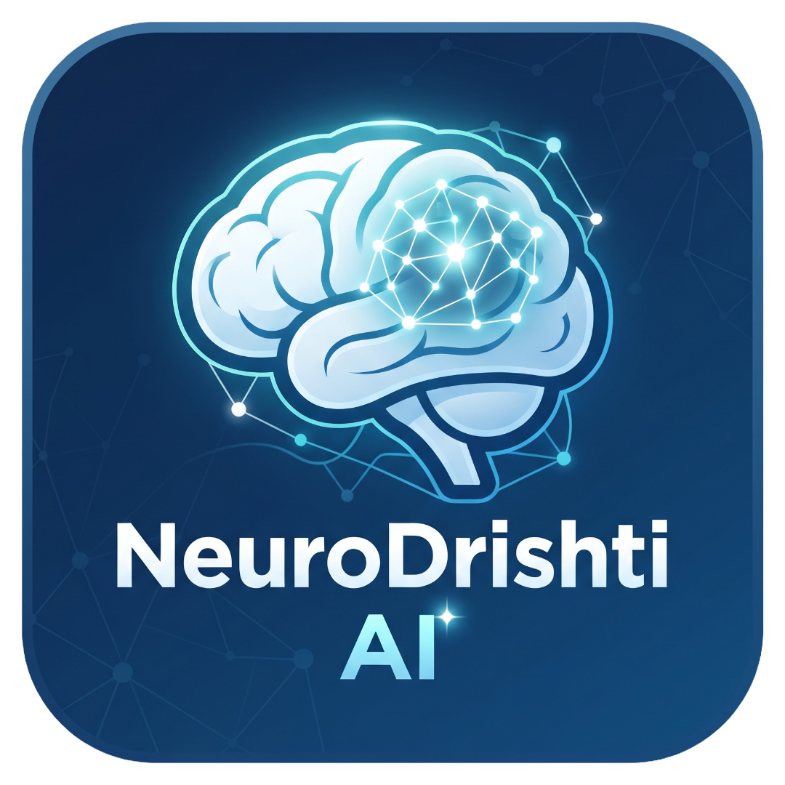
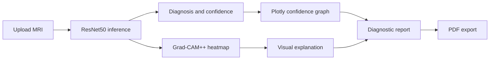

# 🧠 NeuroDrishti AI

**NeuroDrishti AI** is an AI-powered brain MRI analysis research application
designed to assist with brain tumor classification and visual interpretation.

The system uses **ResNet50 transfer learning** to classify MRI images into four
categories and **Grad-CAM++ Explainable AI** to visualize the regions that
contribute to the model's prediction.

> **⚠️ Research & educational project**  
> NeuroDrishti AI is not a medical device and must not be used as a substitute
> for professional medical diagnosis or clinical decision-making.

--

## 📖 Overview

NeuroDrishti AI provides:

- **Four-class MRI classification**
- **ResNet50-based deep learning inference**
- **Grad-CAM++ visual explanations** with heatmap overlays
- **Class-wise prediction confidence** with interactive Plotly charts
- **Clinical context** for predicted classes
- **Structured on-screen diagnostic reports**
- **PDF report generation**
- **Interactive Streamlit interface**
- **Flask REST API** support for model inference

### Supported classification categories

| Class | Description |
| :--- | :--- |
| **Glioma** | Glioma tumor |
| **Meningioma** | Meningioma tumor |
| **Pituitary** | Pituitary tumor |
| **No Tumor** | No detected tumor |

---

## 🛠️ Tech stack

<div align="center">
  
</div>

- **Core:** Python, NumPy, Pillow
- **AI/ML:** TensorFlow, Keras, ResNet50, Scikit-learn, OpenCV, Grad-CAM++
- **Frontend and visualization:** Streamlit, Plotly, Matplotlib
- **Backend and API:** Flask
- **Reporting:** ReportLab

---

## 🔬 AI methodology

### Classification

The classification pipeline uses **ResNet50 transfer learning** with
ImageNet-pretrained weights:

```text
MRI image
    ↓
Image preprocessing (224 × 224 × 3)
    ↓
ResNet50
    ↓
Global average pooling
    ↓
Dropout → Dense layer → Softmax
    ↓
Four-class prediction
```

### Explainable AI (XAI)

NeuroDrishti AI uses **Grad-CAM++** to provide visual explanations of model
predictions. The generated activation map is overlaid on the original MRI image
to highlight regions that contributed to the predicted class.

```text
MRI image
    ↓
ResNet50 feature maps
    ↓
Grad-CAM++ analysis
    ↓
Activation map → Heatmap
    ↓
MRI + heatmap overlay
```

This helps make the model's output more interpretable for research and
educational analysis.

---

## 📊 Research components

The repository also contains experimental implementations for:

- **Classification:** ResNet50, VGG16, VGG19, EfficientNet-B0
- **Segmentation:** U-Net and Attention U-Net
- **Detection:** YOLO-based tumor localization
- **Explainability:** Grad-CAM++
- **Evaluation metrics:** Accuracy, precision, recall, F1-score, Dice, IoU, and mAP

Example experimental results:

- Attention U-Net Dice: **0.899**
- Attention U-Net IoU: **0.6866**
- YOLO mAP@0.5: **0.9166**

> Experimental metrics depend on the dataset, preprocessing pipeline, training
> configuration, and evaluation methodology.

---

## 🔄 Application workflow

The Streamlit application supports an end-to-end MRI analysis pipeline:

1. **Upload MRI**
2. **Run model inference**
3. **Review prediction and confidence analysis**
4. **Inspect Grad-CAM++ visualizations**
5. **Review clinical context**
6. **Generate the diagnostic report**

Confidence results are displayed with interactive Plotly graphs and include the
predicted class, class probabilities, and model confidence.

---

## 🖥️ App visual

<p align="center">
  
</p>

<p align="center">
  <strong>NeuroDrishti AI dashboard</strong><br>
  Upload an MRI scan, review the prediction, inspect Grad-CAM++ explanations,
  compare class confidence, and generate a structured report.
</p>



### Dashboard highlights

| Workspace area | What it shows |
| --- | --- |
| MRI analysis | Upload, prediction cards, original scan, heatmap, and overlay |
| Confidence breakdown | Interactive Plotly graph for all four classes |
| Analysis history | Session-only history in the sidebar with a clear control |
| Diagnostic report | Metadata, prediction, confidence graph, clinical context, and disclaimer |
| Model information | Architecture, classes, evaluation metrics, and confusion matrix |


---

## 🔌 REST API

Run the Flask backend:

```powershell
python api/app.py
```

Available endpoints:

```text
GET  /api/health
POST /api/analyze
```

The `/api/analyze` endpoint accepts an MRI image and returns prediction and
analysis data in JSON format.

---

## 📄 Reports

The application can generate reports containing:

- Predicted tumor class and class probabilities
- Model confidence metrics
- Grad-CAM++ visualization overlays
- Clinical context
- Analysis metadata

The Streamlit interface provides a structured on-screen report and a
downloadable PDF report.

---

## ⚖️ Medical disclaimer

NeuroDrishti AI is developed strictly for **research, educational, and
experimental purposes**. Predictions, visualizations, and reports generated by
this application must not be considered medical advice or a clinical diagnosis.

The system has not been validated or approved for clinical use. MRI
interpretation and treatment decisions must always be performed by qualified
healthcare professionals.

---

## 👥 Team and contributors

### Maintainer

- **Abhinav Birajdar** — [](https://github.com/abhinav28birajdar)

### Contributors

- **Akhand** — [](https://github.com/Akhand-20)
- **Prathamesh** — [](https://github.com/pratham-5-prog)
